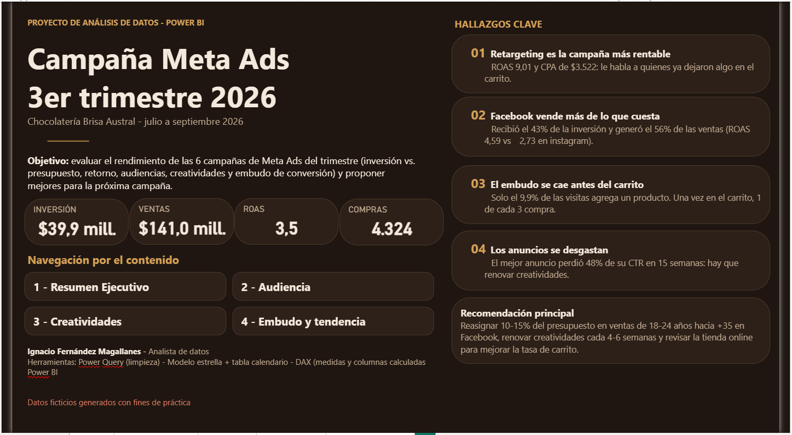
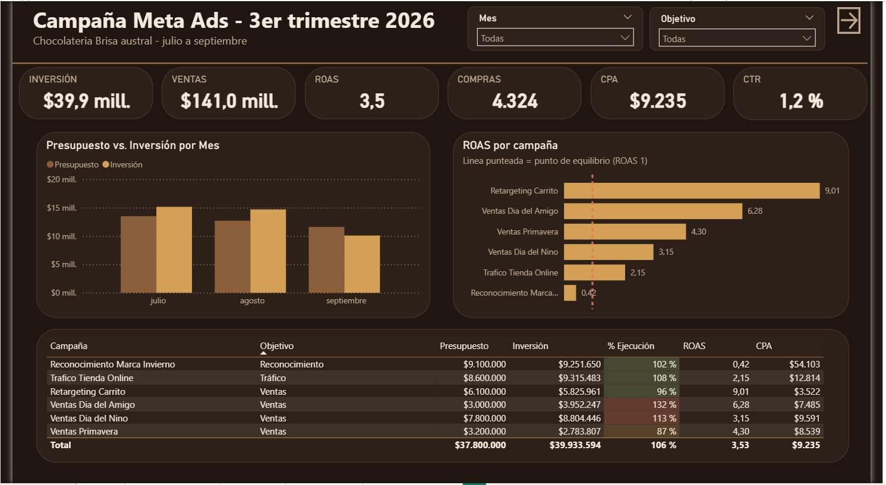
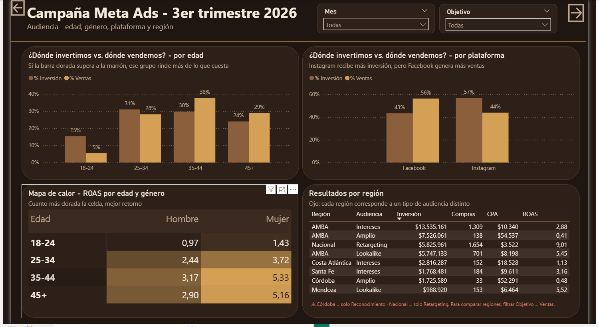
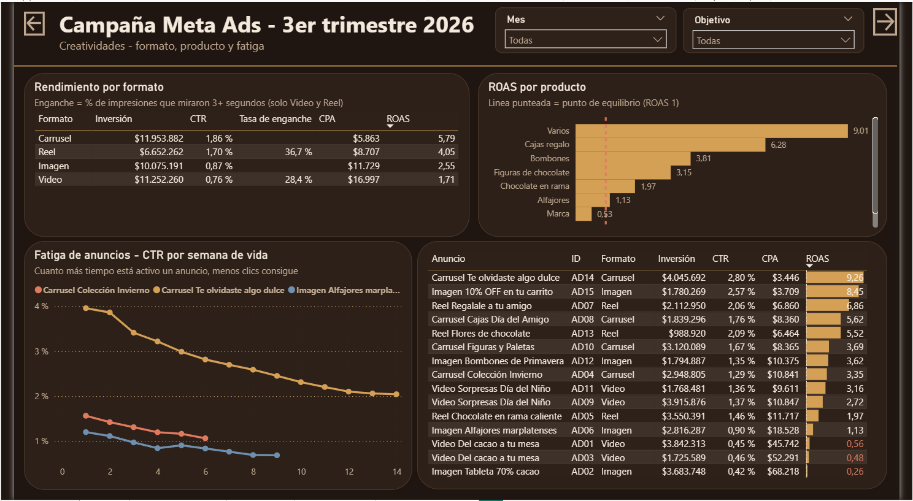
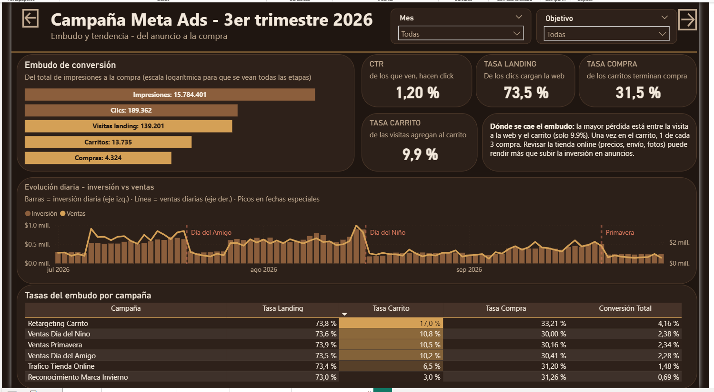

# Campaña Meta Ads en Power BI

Este proyecto es un informe en Power BI que evalúa las 6 campañas de Meta Ads (Facebook e Instagram) que corrió una chocolatería durante el 3er trimestre de 2026, de julio a septiembre. La idea fue armar algo que le sirva al responsable de marketing para ver si la plata invertida en anuncios se está recuperando, qué está funcionando y qué conviene cambiar para la próxima campaña.

> Los datos son ficticios, generados con fines de práctica. La marca "Chocolatería Brisa Austral" es inventada.

## Qué pregunta busca responder

- Cuánto se invirtió contra lo presupuestado y cuánto se vendió gracias a los anuncios (ROAS y costo por compra).
- Qué campañas, audiencias y plataformas rinden más de lo que cuestan y cuáles no.
- Qué formatos, productos y anuncios funcionan mejor, y cuánto tardan en desgastarse.
- En qué etapa del recorrido (anuncio → clic → web → carrito → compra) se pierde más gente.

## Estructura del informe

El archivo tiene una portada con los hallazgos principales y navegación, y cuatro páginas. Todas comparten filtros de mes y objetivo de campaña.

1. **Resumen ejecutivo**: inversión, ventas, ROAS, compras, CPA y CTR; presupuesto vs. inversión por mes; ROAS por campaña con el punto de equilibrio marcado, y una tabla con el % de ejecución del presupuesto de cada campaña.
2. **Audiencia**: comparación entre % de inversión y % de ventas por edad y por plataforma, mapa de calor de ROAS por edad y género, y resultados por región y tipo de audiencia.
3. **Creatividades**: rendimiento por formato (carrusel, reel, imagen y video), ROAS por producto, curva de fatiga de los anuncios (CTR por semana de vida) y ranking de anuncios.
4. **Embudo y tendencia**: embudo de conversión de impresiones a compras, tasas de cada etapa, evolución diaria de inversión vs. ventas con las fechas especiales marcadas y tasas del embudo por campaña.

### Resumen ejecutivo

### Audiencia

### Creatividades

### Embudo y tendencia

## Cómo está armado

Limpié los datos en Power Query y armé un modelo en estrella:

- **Resultados_Diarios**: la tabla de hechos, con una fila por día y anuncio (impresiones, clics, visitas, carritos, compras, inversión y ventas).
- **Campanias**: nombre, objetivo y presupuesto de cada campaña.
- **Conjuntos**: los conjuntos de anuncios, con la segmentación (edad, género, plataforma, región y tipo de audiencia).
- **Anuncios**: formato, producto y nombre de cada anuncio.
- **Calendario**: tabla de fechas para el análisis por mes y por día.
- **Etapas Embudo**: tabla auxiliar para poder mostrar las etapas del embudo en orden en un solo gráfico.

Las medidas están agrupadas en una tabla aparte. Algunas de las que usé:

- Básicas: inversión, ventas, compras, presupuesto y % de ejecución del presupuesto.
- De rendimiento: ROAS (ventas / inversión), CPA (inversión / compras) y CTR (clics / impresiones).
- Del embudo: tasa de landing, tasa de carrito, tasa de compra y conversión total.
- De creatividades: tasa de enganche (impresiones que miraron 3 segundos o más, solo video y reel) y CTR por semana de vida de cada anuncio para medir la fatiga.
- Participación de cada grupo sobre el total de inversión y de ventas, para comparar dónde se invierte contra dónde se vende.

## Lo que muestran los datos

Algunas conclusiones mirando el informe sin filtros:

- **La campaña en general es rentable.** Se invirtieron $39,9 millones y se vendieron $141 millones, un ROAS de 3,5: por cada peso en anuncios volvieron 3,5 en ventas. Se gastó un 6% más de lo presupuestado, sobre todo en Día del Amigo (132%) y Día del Niño (113%).
- **Retargeting es la campaña más rentable.** ROAS de 9,01 y CPA de $3.522, porque le habla a gente que ya dejó algo en el carrito. Reconocimiento de marca tiene ROAS de 0,42, pero su objetivo no es vender sino darse a conocer.
- **Facebook vende más de lo que cuesta.** Recibió el 43% de la inversión y generó el 56% de las ventas (ROAS 4,59 contra 2,73 en Instagram).
- **18-24 años es el grupo que menos rinde.** Se lleva el 15% de la inversión y apenas el 5% de las ventas. En cambio, 35-44 y 45+ venden más de lo que cuestan, y las mujeres tienen mejor ROAS que los hombres en todas las edades.
- **El carrusel es el mejor formato y el video el peor.** El carrusel tiene ROAS 5,79 y el video 1,71. Entre los productos, los anuncios de "Varios" (retargeting) y cajas de regalo son los que más retornan.
- **Los anuncios se desgastan.** El mejor anuncio perdió el 48% de su CTR en 14 semanas, así que conviene renovar las creatividades seguido.
- **El embudo se cae antes del carrito.** De los que entran a la web, solo el 9,9% agrega un producto. Una vez en el carrito, 1 de cada 3 compra.

**Recomendación principal:** pasar entre un 10% y un 15% del presupuesto de ventas de 18-24 años hacia +35 en Facebook, renovar las creatividades cada 4 a 6 semanas y revisar la tienda online (precios, envío, fotos) para mejorar la tasa de carrito.

## Herramientas

- Power BI Desktop
- Power Query para limpieza y modelado
- DAX para las medidas y columnas calculadas

## Cómo verlo

Descargá el archivo `Marketing Chocolates.pbix` y abrilo con Power BI Desktop (es gratuito). El informe se ve con los datos ya cargados.
