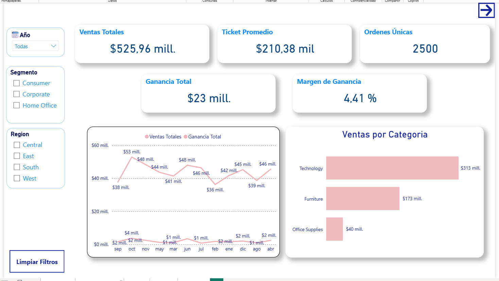
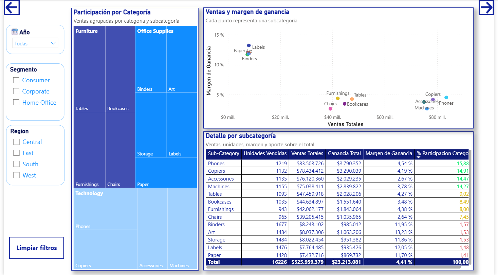
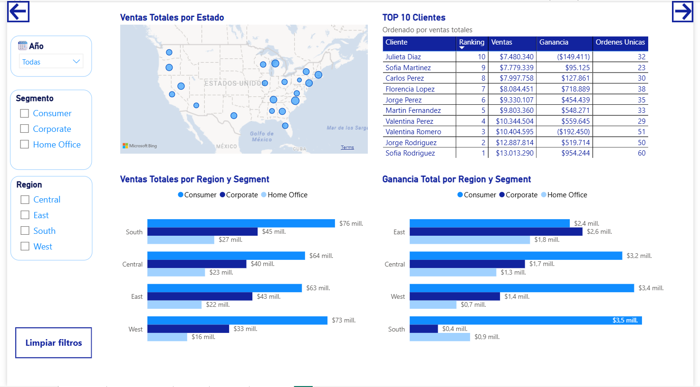
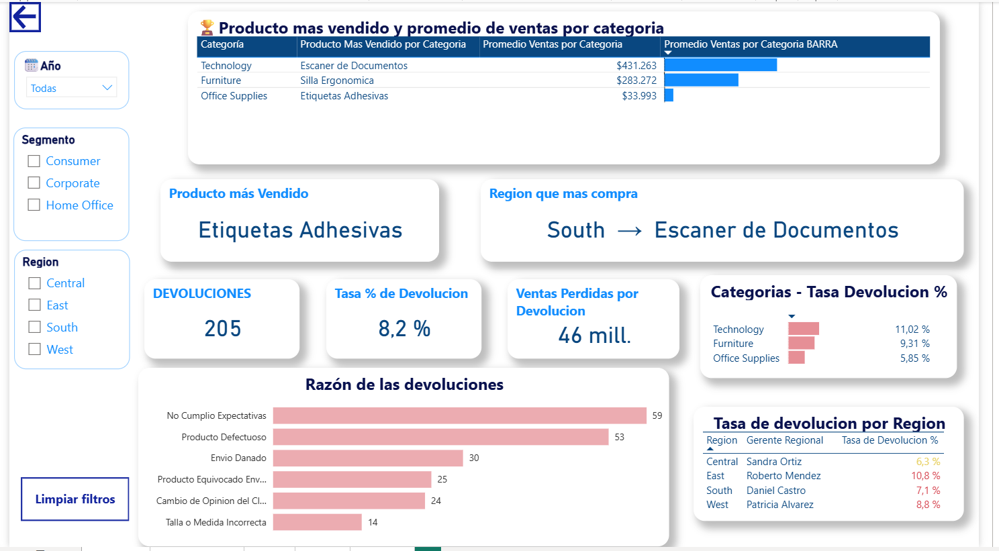

# Análisis de ventas USA en Power BI

Este proyecto es un informe de ventas armado en Power BI sobre una base del estilo Superstore: unas 2.500 órdenes de una cadena minorista de Estados Unidos entre 2023 y 2025. La idea fue construir algo que pudiera usar un gerente comercial para ver en pocos minutos cómo viene el negocio y dónde conviene poner el foco.

## Qué pregunta busca responder

- Cuánto se vende, cuánto se gana y cómo evolucionan las dos cosas en el tiempo.
- Qué categorías y subcategorías sostienen la facturación y cuáles sostienen la rentabilidad, que no siempre son las mismas.
- Quiénes son los clientes más importantes y cómo se reparten las ventas por región, estado y segmento.
- Cuánto se pierde por devoluciones, en qué productos y regiones pasa más y por qué motivos.

## Estructura del informe

El archivo tiene una portada con navegación y cuatro páginas. Todas comparten filtros de región, segmento y año, más un botón para limpiarlos.

1. **Resumen ejecutivo**: ventas totales, ganancia, margen, cantidad de órdenes y ticket promedio, junto con la evolución mensual de ventas y ganancia y las ventas por categoría.
2. **Ventas**: participación de cada categoría y subcategoría, una tabla con el detalle por subcategoría y un gráfico de dispersión que cruza volumen de ventas con margen.
3. **Clientes**: mapa de ventas por estado, ranking de los 10 mejores clientes y comparación de ventas y ganancia por región y segmento.
4. **Productos**: producto más vendido (en general y por categoría), región que más compra, cantidad y tasa de devoluciones, ventas perdidas por devolución, motivos de devolución y tasa por región con su gerente a cargo.

### Resumen ejecutivo

### Ventas

### Clientes

### Productos

## Modelo de datos

Partí de un único CSV y lo separé en Power Query para armar un modelo en estrella:

- **Hechos_Ventas**: una fila por línea de pedido, con ventas, cantidad, descuento y ganancia.
- **Dim_Clientes**, **Dim_Productos** y **Dim_Calendario** como dimensiones.
- **Devoluciones** y **Gerentes_Regionales** como tablas de apoyo, relacionadas por número de orden y por región.

Las medidas están agrupadas en una tabla aparte para que sea fácil encontrarlas. Algunas de las que usé:

- Básicas: ventas, ganancia, margen, órdenes únicas, ticket promedio y unidades vendidas.
- De tiempo: ventas del año anterior, variación interanual y acumulado del año (`SAMEPERIODLASTYEAR`, `TOTALYTD`).
- Participación de cada subcategoría sobre el total, con `CALCULATE` y `ALL`.
- Ranking de clientes con `RANKX`.
- Producto más vendido y región que más compra, resueltos con `ADDCOLUMNS` + `TOPN` + `CONCATENATEX` para que la tarjeta muestre un texto y responda a los filtros.
- Ventas perdidas por devolución, usando `TREATAS` para llevar los números de orden devueltos a la tabla de ventas.
- Formato condicional por color según si una subcategoría está por encima o por debajo del promedio.

## Lo que muestran los datos

Algunas conclusiones que saqué mirando el informe sin filtros:

- **Se vende mucho pero el margen es bajo.** En los tres años se facturaron unos 526 millones con una ganancia de 23 millones, lo que da un margen del 4,4%.
- **La ganancia creció aunque las ventas no.** En 2024 las ventas cayeron cerca de un 15% respecto de 2023, pero la ganancia subió igual y lo siguió haciendo en 2025. Parece que el negocio ganó en eficiencia más que en volumen.
- **Tecnología factura, Insumos de oficina rinde.** Tecnología aporta casi el 60% de las ventas con un margen del 3,8%. Insumos de oficina representa apenas el 7,5% de las ventas, pero tiene un margen del 12% y genera cerca de un quinto de la ganancia total.
- **El Sur es la región que más vende y la que menos gana.** Concentra el 28% de las ventas con el margen más bajo (3,2%). En el Este pasa lo contrario: vende menos y tiene el mejor margen (5,3%).
- **Vender más no siempre es ganar más, tampoco con los clientes.** Dentro del top 10 hay dos clientes que dan pérdida: uno de ellos es el tercero en ventas y aun así deja un resultado negativo. Valdría la pena revisar qué descuentos o productos explican esos casos.
- **Las devoluciones pesan.** Se devolvió el 8,2% de las órdenes, unos 46 millones en ventas. Tecnología tiene la tasa más alta (11%) y el Este es la región con más devoluciones (10,8%). Los motivos más frecuentes son "no cumplió las expectativas" y "producto defectuoso", lo que apunta más a calidad y descripción del producto que a la logística.

## Herramientas

- Power BI Desktop
- Power Query para limpieza y modelado
- DAX para las medidas

## Cómo verlo

Descargá el archivo `Ventas USA.pbix` y abrilo con Power BI Desktop (es gratuito). La consulta original apunta a un CSV local, así que el informe se ve con los datos ya cargados. Si querés actualizarlo, hay que cambiar la ruta del origen en Power Query.
