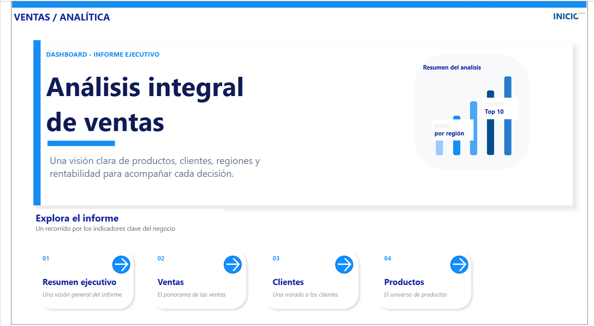

# Portfolio de Análisis de Datos

Hola, soy Nacho, de Mar del Plata (Argentina). Este repositorio reúne mis proyectos de análisis de datos, organizados por área de negocio. Trabajo principalmente con **Power BI** y **Excel**, y estoy sumando **SQL**.

## Proyectos

| Área | Proyecto | Herramientas | Descripción |
|---|---|---|---|
| Ventas | [Análisis de ventas USA](Ventas/Analisis-Ventas-USA) | Power BI, Power Query, DAX | Informe de ventas de una cadena minorista de EE. UU. (2023-2025): rentabilidad, clientes, productos y devoluciones. |
| Ventas | [Análisis de ventas en SQL](Ventas/Analisis-Ventas-SQL) | MySQL, MySQL Workbench | Impacto de los descuentos en la ganancia, causa del bajo margen de la región West y evolución 2023-2025. |
| [Marketing](Marketing) | [Campaña Meta Ads](Marketing/Campania-Meta-Ads-Chocolateria) | Power BI, Power Query, DAX | Rendimiento de 6 campañas de Meta Ads de una chocolatería (3er trimestre 2026): ROAS, audiencias, creatividades y embudo de conversión. |
| [RRHH](RRHH) | Próximamente | | |
| [Finanzas](Finanzas) | Próximamente | | |

## Cómo está organizado

Cada área tiene su carpeta y cada proyecto su propia subcarpeta con:

- un README con el objetivo, las preguntas de negocio y las conclusiones,
- los archivos del proyecto (.pbix, .xlsx o .sql),
- una carpeta capturas con imágenes del resultado.

## Herramientas

- Power BI (Power Query, DAX y modelado en estrella)
- Excel
- SQL
